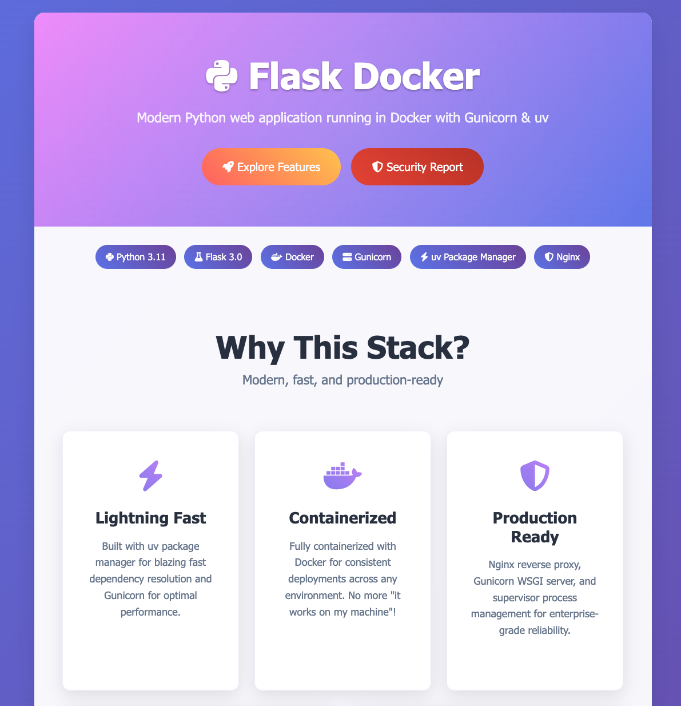
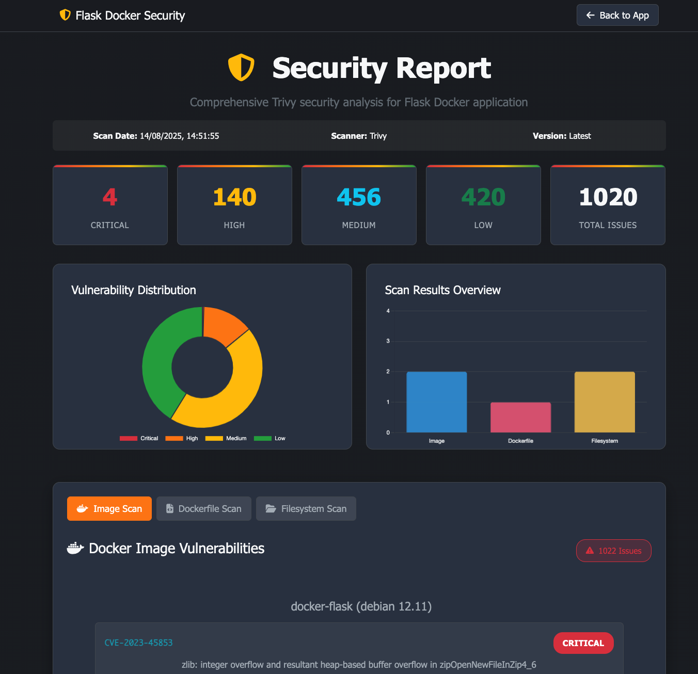

# Flask Docker Application

<div style="text-align: center;">
  
</div>


A modern Flask web application containerized with Docker, featuring automated security scanning and comprehensive monitoring capabilities.

## Overview

This project provides a production-ready Flask application running in Docker with:

- **Modern Python Stack**: Python 3.11, Flask 3.0, Gunicorn 23.0
- **Fast Package Management**: uv package manager for blazing-fast dependency resolution
- **Web Server**: Nginx reverse proxy with Gunicorn WSGI server
- **Process Management**: Supervisor for robust service orchestration
- **Integrated Security**: Dockerized Trivy security scanning with automated reporting
- **Security Dashboard**: Interactive web interface for vulnerability analysis
- **Production Ready**: Optimized Dockerfile with security best practices

## Quick Start

### Prerequisites

- Docker
- Make

### One-Command Deployment

```bash
# Complete security-first deployment (recommended)
make run
```

This single command automatically:
- Pulls latest Trivy security scanner
- Builds the Docker image with latest dependencies
- Performs comprehensive security scanning (image, dockerfile, filesystem)
- Generates fresh security reports
- Starts the application container
- Updates security reports in the running container

### Alternative Commands

```bash
# Build only
make build

# View logs
make logs

# Stop the application
make stop

# Clean up
make clean
```

### Access Points

- **Application**: `http://localhost:8080`
- **Security Dashboard**: `http://localhost:8080/security`

## Security Features


<div style="text-align: center;">
  
</div>

### Dockerized Trivy Integration

This application features fully containerized security scanning with no host dependencies:

```bash
# Complete security-first deployment (includes all scans)
make run

# Manual security operations
make trivy-pull         # Pull latest Trivy Docker image
make scan-all          # Run all security scans
make scan-json         # Generate JSON security reports

# Individual scans (all containerized)
make scan-dockerfile    # Scan Dockerfile for misconfigurations
make scan-image        # Scan Docker image for vulnerabilities  
make scan-python       # Scan Python dependencies
make scan-fs           # Scan filesystem for secrets and configs

# CI/CD friendly (exits with error codes on findings)
make scan-ci

# Update reports in running container
make update-security-reports
```

### Automated Security Workflow


The `make run` command now provides a complete security-first deployment:

1. **Latest Scanner**: Pulls `aquasec/trivy:latest` Docker image
2. **Fresh Build**: Builds application with latest dependencies
3. **Comprehensive Scanning**: Analyzes image, Dockerfile, and filesystem
4. **Report Generation**: Creates JSON reports for web dashboard
5. **Container Deployment**: Starts application with security data
6. **Real-time Updates**: Copies fresh reports to running container

### Security Report Interface

Access the interactive security dashboard at `http://localhost:8080/security`

Features:
- Real-time vulnerability statistics
- Interactive charts and visualizations
- Severity-sorted vulnerability lists (Critical → High → Medium → Low)
- Detailed CVE information with references
- Dockerfile misconfiguration analysis
- Secret detection and filesystem scanning
- **Formatted Markdown Reports**: Enhanced `reports/security-report.md` with emojis and clear sections

### Security Configurations

- **Trivy Configuration**: `trivy.yaml`
- **Ignore Rules**: `.trivyignore`
- **Secret Detection**: `.trivy/secret.yaml`

## Architecture

### Application Stack

- **Base Image**: Debian 12 (bookworm-slim)
- **Python**: 3.11.2 with uv package manager
- **Web Framework**: Flask 3.0.0
- **WSGI Server**: Gunicorn 23.0.0 (3 workers)
- **Web Server**: Nginx 1.22.1
- **Process Manager**: Supervisor 4.2.5

### Directory Structure

```
├── app/
│   ├── app.py              # Flask application
│   ├── requirements.txt    # Python dependencies
│   └── templates/          # HTML templates
├── nginx/
│   └── flask.conf         # Nginx configuration
├── supervisor/
│   └── supervisord.conf   # Supervisor configuration
├── reports/               # Security scan reports
├── .trivy/               # Trivy configurations
├── Dockerfile
├── Makefile
└── README.md
```

### Container Architecture

The application runs multiple services managed by Supervisor:
- **Gunicorn**: Python WSGI server on port 8000 (as `appuser`)
- **Nginx**: Reverse proxy on port 8080 (non-privileged port)
- **Security**: Container runs as non-root user (`appuser`) for enhanced security

## Development

### Local Development

```bash
# Complete development environment (with security scanning)
make run

# View application logs
make logs

# Access container shell
docker exec -it flask-app /bin/bash

# Quick development iteration (build only)
make build
```

### Adding Features

1. Modify the Flask application in `app/app.py`
2. Update dependencies in `app/requirements.txt`
3. Deploy with security scanning: `make run`
4. Review security dashboard: `http://localhost:8080/security`

### Security Best Practices

The Dockerfile implements security best practices:
- **Non-root user execution**: Container runs as `appuser` (resolves AVD-DS-0002)
- **Non-privileged port**: Uses port 8080 instead of 80 for enhanced security
- **Minimal package installation**: Uses `--no-install-recommends` flag
- **Multi-stage build**: Optimized for smaller image size
- **Health checks**: Built-in container health monitoring on port 8080
- **Proper file permissions**: Secure ownership and access controls
- **Automated markdown reports**: Enhanced security documentation generation

## Configuration

### Environment Variables

The application can be configured through environment variables:
- `FLASK_ENV`: Set to `development` or `production`
- `GUNICORN_WORKERS`: Number of Gunicorn worker processes (default: 3)

### Nginx Configuration

Customize the reverse proxy settings in `nginx/flask.conf`:
- Server name and port configuration
- SSL/TLS settings
- Rate limiting and security headers

### Supervisor Configuration

Modify process management in `supervisor/supervisord.conf`:
- Service startup order
- Restart policies
- Logging configuration

## Monitoring and Logging

### Application Logs

```bash
# View all container logs
make logs

# Follow logs in real-time
docker logs -f flask-app

# View specific service logs
docker exec flask-app supervisorctl tail -f gunicorn
docker exec flask-app supervisorctl tail -f nginx
```

### Health Checks

The container includes built-in health checks:
- **Endpoint**: `http://localhost:8080/`
- **Interval**: 30 seconds
- **Timeout**: 10 seconds
- **Retries**: 3

### Performance Monitoring

Monitor application performance:
- **Process Status**: `docker exec flask-app supervisorctl status`
- **Resource Usage**: `docker stats flask-app`
- **Container Health**: `docker ps` (shows health status)

## Deployment

### Production Deployment

For production deployment, consider:

1. **Environment Variables**: Set production configurations
2. **SSL/TLS**: Configure HTTPS in nginx
3. **Database**: Add database connectivity
4. **Load Balancing**: Use multiple container instances
5. **Monitoring**: Implement comprehensive logging and monitoring

### Docker Compose Example

```yaml
version: '3.8'
services:
  flask-app:
    build: .
    ports:
      - "8080:8080"
    environment:
      - FLASK_ENV=production
    restart: unless-stopped
    healthcheck:
      test: ["CMD", "curl", "-f", "http://localhost:8080/"]
      interval: 30s
      timeout: 10s
      retries: 3
```

### CI/CD Integration

For automated security scanning in CI/CD pipelines:

```bash
# CI-friendly security scan (exits with error codes on vulnerabilities)
make scan-ci

# Complete deployment workflow for CI/CD
make run  # Includes build, scan, and deploy
```

The dockerized Trivy approach eliminates host dependencies, making CI/CD integration seamless across different environments.

## Troubleshooting

### Common Issues

**Container won't start:**
```bash
# Check container logs
make logs

# Verify image build
docker images docker-flask
```

**Application not accessible:**
```bash
# Check port binding (should show 8080:8080)
docker ps

# Verify nginx configuration
docker exec flask-app nginx -t

# Test direct access
curl http://localhost:8080
```

**Security scan failures:**
```bash
# Pull latest Trivy image and clear cache
make trivy-pull

# Check Trivy configuration with dockerized scanner
docker run --rm -v $(PWD):/workspace aquasec/trivy:latest config /workspace
```

### Debug Mode

Enable debug logging:
```bash
# Run with debug output
docker run -it --rm -p 8080:8080 docker-flask

# Check service status
docker exec flask-app supervisorctl status
```

## Contributing

1. Fork the repository
2. Create a feature branch
3. Make your changes
4. Deploy with security scanning: `make run`
5. Verify security dashboard shows no new issues
6. Submit a pull request

## License

This project is licensed under the MIT License - see the LICENSE file for details.

## Changelog

### Latest Version
- **Security Hardening**: Resolved AVD-DS-0002 by running as non-root user (`appuser`)
- **Non-Privileged Port**: Migrated from port 80 to 8080 for enhanced security
- **Enhanced Markdown Reports**: Formatted security reports with emojis and sections
- **Dockerized Security Scanning**: Full containerization of Trivy security analysis
- **One-Command Deployment**: `make run` includes build, scan, and deploy workflow
- **Automated Security Reports**: Real-time vulnerability data with markdown generation
- **Interactive Security Dashboard**: Severity-sorted vulnerability interface
- **Dependency-Free CI/CD**: No host tool requirements for security scanning
- **Enhanced Make Targets**: Comprehensive security scanning automation
- **Upgraded Security Stack**: Gunicorn 23.0.0 and latest Trivy integration
- **Fast Package Management**: uv package manager for optimized builds

## Support

For issues and questions:
- Check the troubleshooting section above
- Review container logs with `make logs`
- Deploy with `make run` for comprehensive diagnostics
- Check security dashboard at `http://localhost:8080/security`
- Review markdown security report at `reports/security-report.md`
- Create an issue in the project repository
